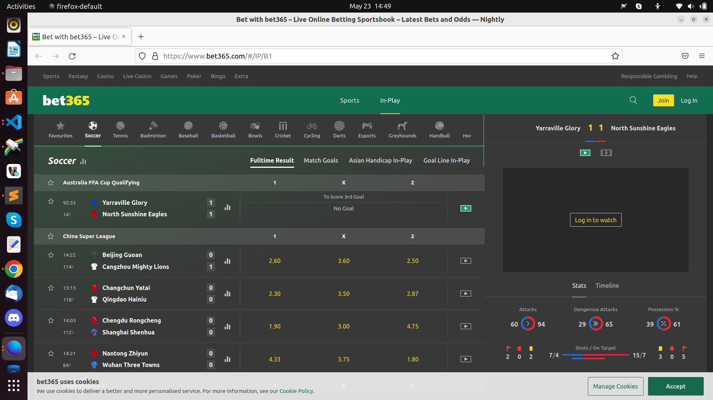

# Screencast

<!--  -->
# About this code

This code uses playwright-python v1.25.1

I use older version of Playwright so that it can install older browser versions.
https://github.com/microsoft/playwright-python/releases/tag/v1.25.1

you can play with other versions and check if bet365 will be loaded.
Also, make sure to remove other browsers that were installed earlier

They are located here

`%USERPROFILE%\AppData\Local\ms-playwright on Windows`

`~/Library/Caches/ms-playwright on MacOS`

`~/.cache/ms-playwright on Linux`

# Things to Note
## bet365 fully loads all modules  on fullscreen (maximized browser window)
## Will not load when DevTools in open
## Will not work when browser is incognito
